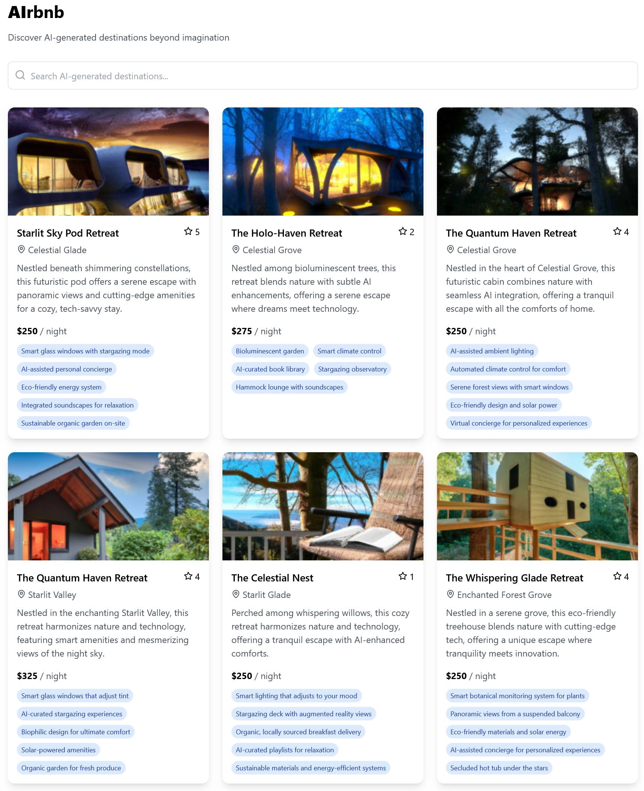

# AIrbnb - AI generated listings



# Installation
## Backend
```md
cd backend/
bun install
# Run the server
bun src/index.ts
```
The server will be available at `http://localhost:3000`.
## Frontend
```md
cd frontend/
bun install
# Run the frontend server (development mode)
bun dev
```
The frontend will be available at `http://localhost:5173` (default Vite port).
